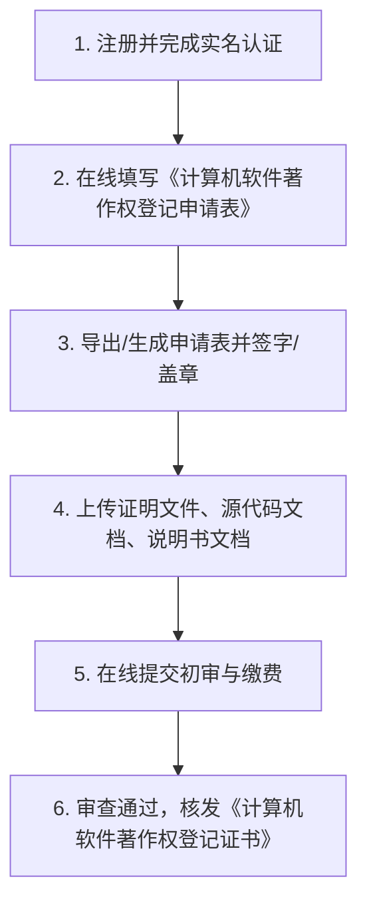

# 中国版权保护中心 (CPCC) 计算机软件著作权申请全流程指南

---

## 🌐 官方申请平台

- **官方网站**：中国版权保护中心（CPCC）微平台 / 在线登记系统
- **统一申报入口**：[https://register.ccopyright.com.cn/](https://register.ccopyright.com.cn/)
- **服务大厅**：中国版权保护中心官网 [https://www.ccopyright.com.cn/](https://www.ccopyright.com.cn/)

---

## 📋 软著申请全流程（6 个步骤）

### 步骤 1：账号注册与实名认证
1. 访问 [https://register.ccopyright.com.cn/](https://register.ccopyright.com.cn/) 进行注册。
2. **个人申请**：上传身份证正反面，完成人脸识别或实名核验（1~3 个工作日完成认证）。
3. **企业/机构申请**：上传营业执照副本扫描件、法定代表人身份证、企业委托书。

### 步骤 2：在线填报信息表（直接复制以下内容）

| 字段名称 | 填报建议内容 | 说明 |
|---|---|---|
| **软件全称** | `基于网格碰撞与领地争夺的双人实时对战游戏软件` | 必须以“软件”或“系统”结尾，不能带符号。 |
| **软件简称** | `昼夜领地对战`（或留空） | 选填。 |
| **版本号** | `V1.0` | 必须以大写 V 开头，格式如 V1.0。 |
| **开发完成日期** | `2026年08月30日` | 填写实际开发完成的时间。 |
| **发表状态** | `已发表`（填公开日期）或 `未发表` | 均可，已在 GitHub 公开可填“已发表”。 |
| **开发方式** | `独立开发` | 勾选独立开发。 |
| **权利取得方式** | `原始取得` | 勾选原始取得。 |
| **权利范围** | `全部权利` | 勾选全部权利。 |
| **编程语言** | `JavaScript, HTML5, CSS3` | 原生前端开发语言。 |
| **源程序量** | `2411 行` | 填写实际源代码总行数。 |
| **开发硬件环境** | `MacBook Pro (Apple Silicon M系列) / PC x86_64, 内存 16GB` | 填写开发机器配置。 |
| **运行硬件环境** | `PC / Mac / 移动设备 (CPU 1.5GHz+, 内存 2GB+, 显示器)` | 运行该游戏所需最低配置。 |
| **开发软件环境** | `macOS 15.0 / Visual Studio Code / Node.js` | 开发工具与系统。 |
| **运行软件环境** | `Chrome 88+ / Edge / Safari 14+ / Firefox 85+ 浏览器` | 运行浏览器环境。 |
| **主要功能与技术特征** | （见下方模板，直接复制） | 简明扼要概括系统主要功能。 |

#### 主要功能与技术特征填写模板：
> 本软件基于 HTML5 Canvas 2D 与 Web Audio API 构建，实现了双人 1v1 领地网格实时碰撞竞技对战系统。主要功能模块包括：
> 1. 领地碰撞同化引擎：基于亚步长插值算法实现多段连破网格同化；
> 2. 挡板博弈与能量偷取：挡板接球实现能量偷取、减速惩罚与速度-连破分级绑定；
> 3. 大招激光与护盾格挡：实现挡板对准的 3 行等离子激光大招，支持防守挡板实时格挡阻断、后方领地保护与反充回复；
> 4. 石化要塞道具模块：支持 5 格具备 2 层护甲的石化方块防御同化；
> 5. 智能 AI 对抗与多模式控制：支持 4 档预测性拦截 AI 算法、双人 PVP 及禅意模拟观战。

### 步骤 3：准备并上传两大核心文档

| 文档名称 | 本地文件路径 | 格式要求 |
|---|---|---|
| 📄 **1. 源代码文档** | `copyright_docs/1_软件源代码文档.txt` | • 总行数不足 3000 行，需提交全部源码（已汇总 2411 行）； • 每页不少于 50 行； • 页眉标注软件全称与版本号； • 页脚标注连续页码（第 X 页 共 Y 页）。 |
| 📘 **2. 用户使用说明书** | `copyright_docs/2_软件用户使用说明书.md` | • 详细介绍软件功能、界面、操作方式与流程； • 图文并茂（配游戏运行界面截图）； • 页眉页脚格式与源代码保持一致。 |

### 步骤 4：生成申请表并签署
- 系统会根据填报内容自动生成《计算机软件著作权登记申请表》（PDF）；
- 下载申请表打印，在第三页“申请人签章”处：个人手写签名，企业加盖公章并法定代表人签字，然后彩色扫描上传。

### 步骤 5：提交初审
- 确认全部材料上传无误后，点击“确认提交”；
- 个人或非赢利性普通登记目前免收官方登记费。

### 步骤 6：领证
- 普通审查周期通常为 **30 ~ 60 个工作日**；
- 审核通过后，中国版权保护中心会核发《计算机软件著作权登记证书》（电子证书或纸质证书）。

---

## ⚠️ 常见补正雷区与注意事项（必看）

1. **名称一致性（最高频驳回原因）**：
   - 申请表上的软件全称、源代码文档页眉、说明书封面及页眉中的名称与版本号**必须 100% 一字不差**（例如必须统一为 `基于网格碰撞与领地争夺的双人实时对战游戏软件 V1.0`）。
2. **代码注释与个人信息**：
   - 源代码中**严禁出现与申请人不符的他人名字、第三方版权信息、临时占位符**；
   - 本地已为您生成的 `1_软件源代码文档.txt` 已经过脱敏与格式规范处理。
3. **说明书截图规范**：
   - 说明书中引用的游戏截图，浏览器地址栏或窗口标题如果包含日期、用户名，需保持真实一致，不得有修图遮盖痕迹。
4. **每页行数规范**：
   - 转成 Word 或 PDF 提交时，源代码页面每页必须**不少于 50 行**（建议采用 Courier New 或 Consolas 9pt 字体，单倍行距）。
